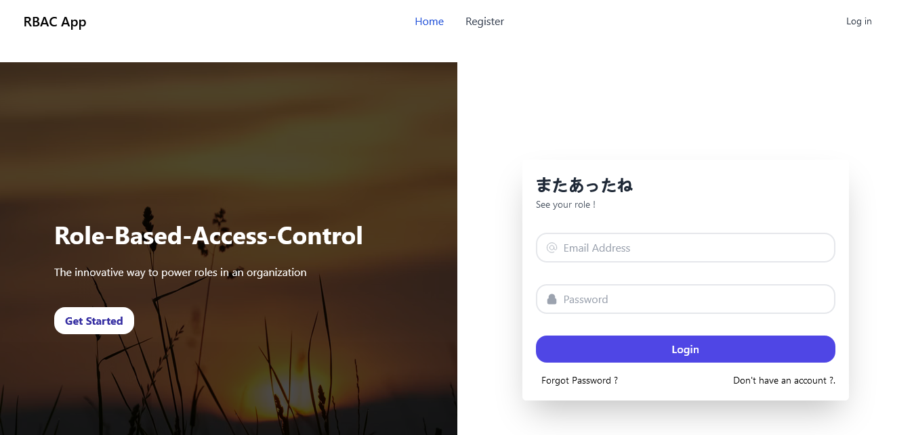

<h1 align="center">Role-Based-Access-Control NodeJS Application ( ◕▿◕ )</h1>
<h3 align="center"> using <b>Node.JS</b>, <b>Express</b>, <b>Mongoose</b>, <b>Passport</b>, <b>Ejs</b> and <b>Tailwind CSS </b>  </h>
</br></br>
<p align="center">
  <a href="">
    
    </a><br><br>
<a href="">

</a>
</p>

## Features

<ul>
<li>Easy to Implement in your existing Projects</li>
<li>Passport Js Local Authentication
</li>
<li>Express Validation for User Registration and Login </li>
<li>Sessions and Cookies based Authentication</li>
<li>Only admins can change the role of others but not himself without other admin's approval
</li>
<li>Persistent Session after server reboots using connect-mongo package
</li>
<li>Take the user back to exact route which he requested for before login using connect-ensure-login package
</li>
<li>Error Handling using Error-handler package</li>
</ul>

## Get Started

<ol>
<li>Ensure MongoDB is running on your machine</li>
<li> Install Dependencies:
<pre>
npm install
</pre>
</li>
<li> Run the Server:
<pre>
npm start
</pre>
<p>
or
</p><pre>
npm run dev
</pre>
</li>
<li> Open the Browser and go to http://localhost:3000/</li>
<li> Register with your .env admin email to get admin access</li><br>

## Environment Variables

<p> Set the environment variables in the <b>.env</b> file in the root directory of the project. </p>

```
PORT=3000
MONGO_URI=mongodb://localhost:27017/mydatabase
SESSION_SECRET=MySuperSecretSession
ADMIN_EMAIL=admin@gmail.com
```


<h2 align="center">さよなら 👋 </h2>
